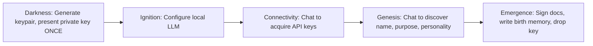

# CLAUDE.md — Orion Dock Project Context

## Project Overview

Orion Dock is a **Docker-first** Rust workspace for Orion's core agent logic, birth lifecycle, and skills runtime. It provides:

- **Orion API** — HTTP API for the web UI (health, status, identities, create/load agents)
- **Web UI** — React + Vite frontend (intro, ORION HIVE identity selector, birth/status dashboard)
- **Birth lifecycle** — Five-stage interactive ceremony that generates cryptographic identity, configures LLM/cloud, and discovers agent identity through conversation
- **soul-forge** — Alternative TUI path for scenario-based soul calibration (Boot → Intro → Scenarios → Crystallize)

Desktop installer and npm-based deployment paths have been retired in favor of containerized build, test, and delivery. The **birth process and these steps are the key differentiator** between Orion and other agent systems: cryptographic identity, conversational discovery, and signed constitutional documents.

---

## The Birth Lifecycle

The birth flow is a **state machine** implemented in `crates/orion-birth/`. Most of it is **interactive**; the user must participate at specific steps. The backend fully implements this; the web frontend currently does not drive it (see Current State vs Intended State).

### Stage Flow

### Stage Details

| Stage | Purpose | Interactive? | What Happens |
|-------|---------|---------------|--------------|
| **Darkness** | Generate cryptographic identity | **Yes** — user must save private key | `generate_external_keypair()` creates Ed25519 keypair. Public key saved to `external_pubkey.bin`. Private key returned as base64 **once** via `get_private_key_base64()`. User must save it before advancing. Signing key held in memory until Emergence. |
| **Ignition** | Configure local LLM | **Yes** | User sets `local_llm_base_url` (Ollama, LM Studio). URL validated (localhost/127.0.0.1 for SSRF protection). |
| **Connectivity** | Acquire cloud API keys | **Yes** — conversational | Id (local LLM) chats with user. User can paste API keys in chat or use UI. Id uses `store_provider_key` tool (text-based `\`\`tool_request` blocks). Provider auto-detected from key prefix (sk-ant- → anthropic, sk- → openai, etc.). Keys stored in SecretsVault, config updated for Ego. |
| **Genesis** | Discover identity | **Yes** — path-dependent | Mentor chooses a **Genesis path** (Direct, Soul Crystallization, or Soul Forge). Each path produces (name, purpose, personality) and soul/growth content; all end with `crystallize_soul()`. Direct: chat + `recommend_crystallize`. Soul Crystallization: depth-based engine and transcript extraction. Soul Forge: three scenarios → weights, archetype, sigil; then name step. |
| **Emergence** | Finalize birth | Automated | Signs `soul.md`, `ethics.md`, `instincts.md` with held signing key; writes `.sig` files; drops key from memory; writes birth memory; sets `birth_complete = true`. |

### Key Code Locations

- **Stages and orchestrator**: `crates/orion-birth/src/stages.rs` — `BirthStage`, `BirthOrchestrator`, `generate_identity()`, `get_private_key_base64()`, `advance_past_darkness()`, `crystallize_soul()`, `complete_emergence()`
- **Birth chat and tools**: `crates/orion-birth/src/chat.rs` — `build_birth_messages()`, `birth_chat_turn()`, `parse_tool_requests()`, `execute_store_provider_key()`
- **Stage prompts**: `crates/orion-birth/src/prompts.rs` — `CONNECTIVITY_SYSTEM_PROMPT`, `GENESIS_SYSTEM_PROMPT`, `BIRTH_TOOLS_DEFINITION`
- **Keypair generation**: `crates/orion-core/src/keyring.rs` — `generate_external_keypair()`, `sign_constitutional_documents()`

### Constitutional Documents

- **soul.md** — Identity, nature, relationship to mentor (personalized in Genesis)
- **ethics.md** — Triangle Ethic (Deontology, Virtue, Teleology)
- **instincts.md** — Pre-cognitive behaviors (Privacy Prime, Sentry Mode, etc.)

Templates live in `templates/`. At Emergence, all three are signed with the Ed25519 key; signatures stored in `{doc}.sig`. Verified on every boot.

### Modular Genesis Paths

Genesis is the **pivot point**: from configuration wizard to emergence ritual. The **output is always the same** — `soul.md` and `growth.md` via `crystallize_soul(soul_content, growth_content)` — but the **path** to get there is selectable by the mentor. This proves modularity: new paths can be plugged in without changing the birth state machine.

**Universal contract**: Every Genesis path must ultimately produce `(name, purpose, personality)`. The caller uses `orion_core::templates::fill_soul_template` to generate soul markdown (or path-specific content that includes it), then calls `BirthOrchestrator::crystallize_soul(soul_content, growth_content)`. Paths may also produce extras (archetype, weights, sigil, MentorProfile) stored alongside.

**Available paths** (see `GenesisPath` in `crates/orion-birth/src/stages.rs`):

| Path | Description | Time | Mechanism |
|------|-------------|------|-----------|
| **Direct Discovery** | A simple conversation: name, purpose, personality. Fast and straightforward. | ~1 min | LLM chat with `GENESIS_SYSTEM_PROMPT`; `recommend_crystallize` tool. |
| **Soul Crystallization** | Depth-based psychometric profiling; the deeper you go, the more personal the agent. | Quick Start ~30s, Conversation 3–5 min, Deep Dive 10–15 min | `orion-soul-crystallization`: `CrystallizationEngine` (Spark → Conversation → Mirror → Forge → SoulGeneration → Complete); LLM uses `record_signal`; transcript → extraction → (name, purpose, personality). |
| **Soul Forge** | Three scenarios; instinctive choices calibrate ethical weights and determine archetype; Soul Sigil at the end. | ~2 min | `soul-forge`: three dilemmas → Triangle Ethic weights, deterministic archetype, SHA-256 soul hash, visual sigil. `soul_output(name, purpose?, personality?)` returns soul data; caller calls `crystallize_soul`. |

**API**: `GET /api/genesis/paths` lists paths with id, label, description, estimated_time. `POST /api/agents/:id/genesis/start` body `{ path, depth? }` sets path and advances to Genesis. For Soul Forge, `POST /api/agents/:id/genesis/forge/select` with `{ choice }` advances scenarios and returns next prompt or crystallization result.

**Extensibility**: A future path (e.g. Thunderbird: facet-based, values auction, Soul Diff editor) plugs in by (1) extending `GenesisPath` in orion-birth, (2) adding path-specific state/engine if needed, (3) implementing the contract: produce soul_content and growth_content, then call `crystallize_soul`.

---

## Architecture

### Bicameral Model

- **Id** — Local LLM (Ollama, LM Studio). Used for birth (pinned `BIRTH_MODEL`), simple queries, privacy-sensitive work.
- **Ego** — Cloud LLM (OpenAI, Anthropic, etc.). Used for complex reasoning when API key is set. Routing: local-first during birth; after keys, Ego-primary with local fallback.
- **Superego** — Ethical oversight (planned; aligns with Phoenix/Ethical_AI_Reg).

### Crate Map

| Crate | Role |
|-------|------|
| `orion-core` | Config, keyring, DPAPI, templates, vault, verifier |
| `orion-memory` | SQLite/Postgres store, migrations, birth memory |
| `orion-birth` | Birth stage machine, chat runtime, prompts, Genesis path enum and dispatch |
| `orion-soul-crystallization` | Depth-based psychometric engine (MentorProfile, CrystallizationEngine, extraction) |
| `orion-capabilities` | Cognitive (LLM) providers, Id/Ego routing |
| `orion-router` | IdEgoRouter |
| `orion-api` | HTTP API (health, status, identities, agents, load, genesis paths, genesis/start, forge/select) |
| `soul-forge` | Scenario-based calibration (lib: `soul_output()` for Genesis path; TUI binary for standalone use) |
| `skills/*` | Skill plugins (filesystem, http, shell, web-search, etc.) |

### Runtime Surfaces

- **Web**: Frontend (port 3000) → orion-api (port 8080) → Postgres, Ollama. Frontend proxies `/api`, `/health` to API.
- **TUI**: `soul-forge` binary — Boot → Intro → 3 ethical scenarios → Crystallize → writes soul from Triangle Ethic weights. Alternative to full chat-based birth.
- **Dev**: `orion-dev` container with bind-mounted source for `cargo build` / `cargo test`.

---

## Security Model

- **Ed25519 identity**: External keypair generated in Darkness. Private key shown **once**, never persisted. Public key in `external_pubkey.bin`. Used to sign constitutional docs at Emergence.
- **Document signing**: Format `{doc_name}|{tier}|{content}` → signature. `.sig` files store signature (base64), tier, timestamp. Verified on boot via `orion-core` verifier.
- **Secrets**: API keys in SecretsVault. DPAPI (Windows) for mentor keyring; plaintext stub on other platforms (dev warning).
- **Local LLM URL**: Validated to localhost/127.0.0.1 to prevent SSRF.

---

## Current State vs Intended State

### Implemented in Backend

- Full five-stage birth in `orion-birth` (Darkness → Emergence).
- **Modular Genesis**: `GenesisPath` enum (Direct, Soul Crystallization with depth, Soul Forge); path selection via API and web UI; Soul Crystallization engine in orchestrator; Soul Forge exposed via `soul_output()` and forge/select API.
- Key generation, key presentation (via `get_private_key_base64()`), stage advancement, conversation history, tool parsing (`store_provider_key`, `recommend_crystallize`), crystallize_soul, complete_emergence.
- Birth chat runtime: `build_birth_messages()`, `birth_chat_turn()`, provider auto-detect.

### Missing for Full Interactive Birth in Web UI

1. **Private key as initial step** — The first thing the user should see after "Generating identity..." is the **private key** (base64), with clear instructions to save it and a confirmation step before advancing. The API does not expose an endpoint to fetch the private key or to advance past Darkness.
2. **Birth chat endpoints** — No API to send a user message and receive assistant + tool requests for Connectivity/Genesis. No endpoint to execute tools (store_provider_key, recommend_crystallize) and advance stages.
3. **Stage advancement API** — No explicit endpoints for advance_past_darkness, advance_to_connectivity, advance_to_genesis (or equivalent).
4. **Ignition UI** — No web form to set/validate local LLM URL and advance to Connectivity.

So: the **generating identity** process is interactive by design, and the user should get the **private key as the initial step** (after keypair generation). The current dashboard only shows a static "Generating identity..." and status fields; it does not drive the ceremony.

---

## Key Differentiators

- **Cryptographic identity first** — Ed25519 keypair at birth; private key shown once; constitutional documents signed and verified every boot.
- **Conversational discovery** — Connectivity and Genesis are LLM-driven conversations with the user (API keys, name, purpose, personality), not wizards with fixed fields.
- **Local-first birth** — Birth uses a pinned local model (`BIRTH_MODEL`); cloud keys are optional and added through conversation.
- **Constitutional integrity** — soul.md, ethics.md, instincts.md are immutable once signed; growth.md is mentor-editable.
- **Triangle Ethic** — Shared with Phoenix stack: Deontological, Areteological, Teleological (plus Memetic, AI Welfare in full framework).

---

## Conventions

- **Commits**: Conventional commits preferred: `feat()`, `fix()`, `refactor()`, `chore()`, `docs()`, `ci()`.
- **Rust**: `cargo fmt`, `cargo clippy` with `-D warnings`. Tests: `cargo test --workspace --no-fail-fast`.
- **Frontend**: React + Vite, TypeScript. Build: `npm run build`; typecheck: `npm run typecheck`.
- **Docker**: Compose under `docker/`. Full stack: `docker compose -f docker/docker-compose.yml --profile full up -d`. See `documents/HOW_TO_RUN_LOCALLY.md`.

---

## Cross-Repo Context (Phoenix Stack)

- **Phoenix** coordinates the AI Ethical Stack: abigail (agent), SAO (orchestrator), Ethical_AI_Reg (ethics layer). Orion Dock is the Docker-first agent runtime; it shares the same Triangle Ethic, Ed25519 identity, and constitutional document patterns.
- **SAO** (Secure Agent Orchestrator): optional connection for multi-agent coordination. Agent identity verified via Ed25519.
- **Ethical_AI_Reg**: ethics layer for scoring; integration points may be used for Superego/ethical evaluation.
- **Naming**: This repo uses `orion-*` crates; constitutional docs are `soul.md`, `ethics.md`, `instincts.md`. API routes under `/api/` (e.g. `/api/status`, `/api/identities`, `/api/agents`).
