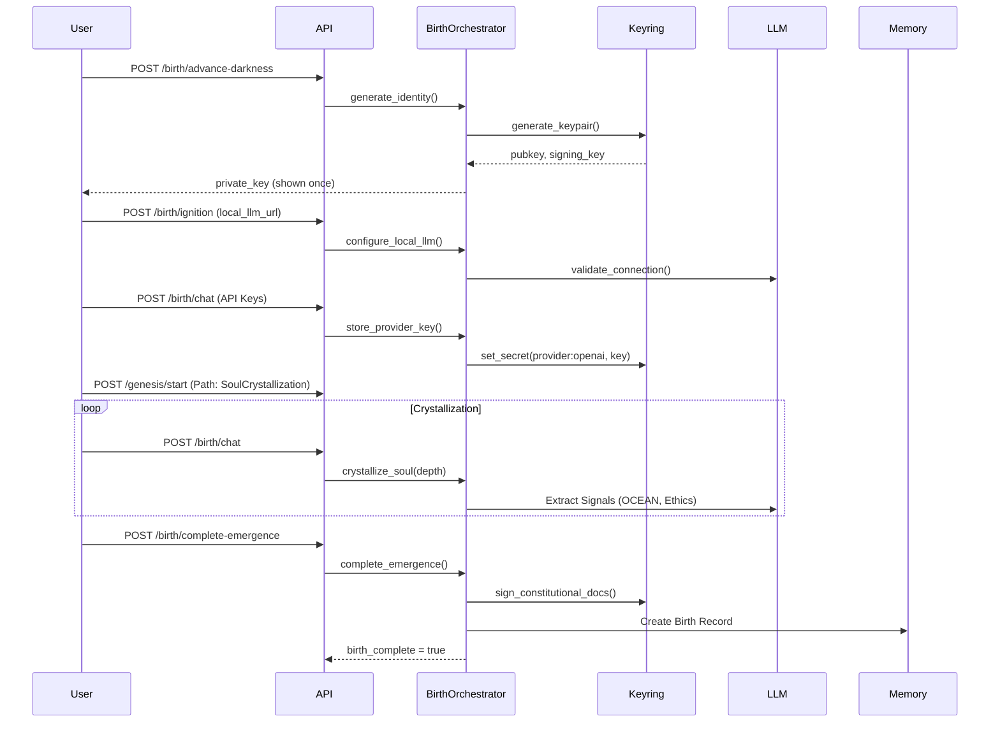
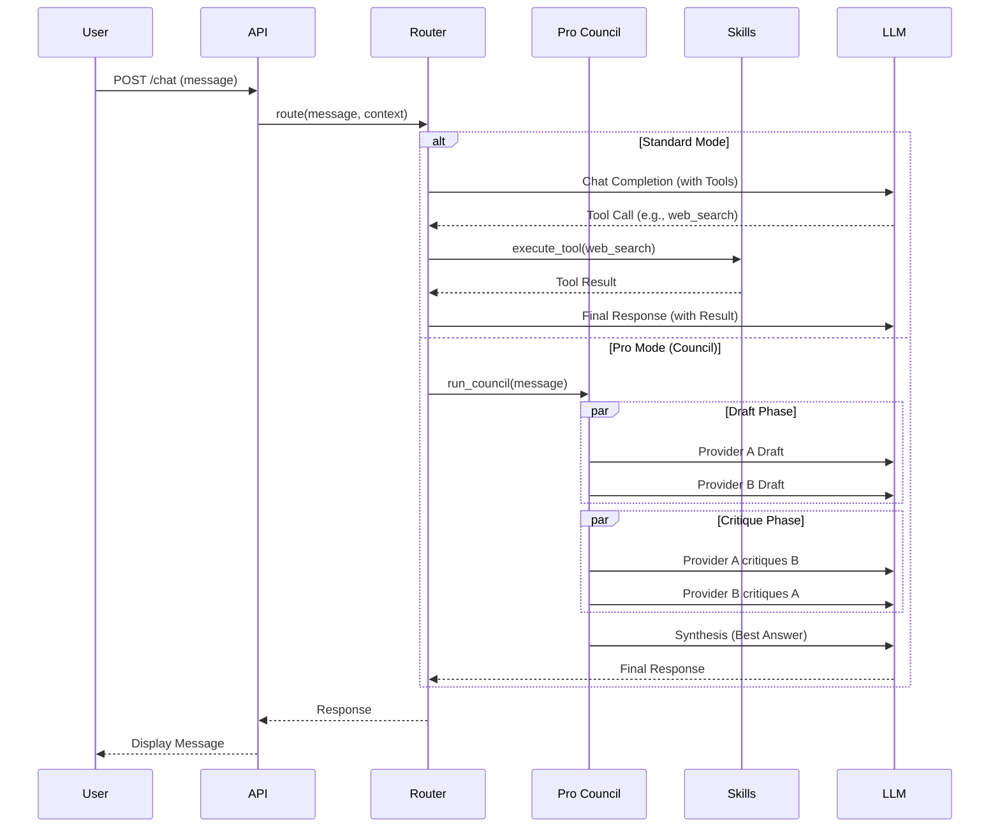
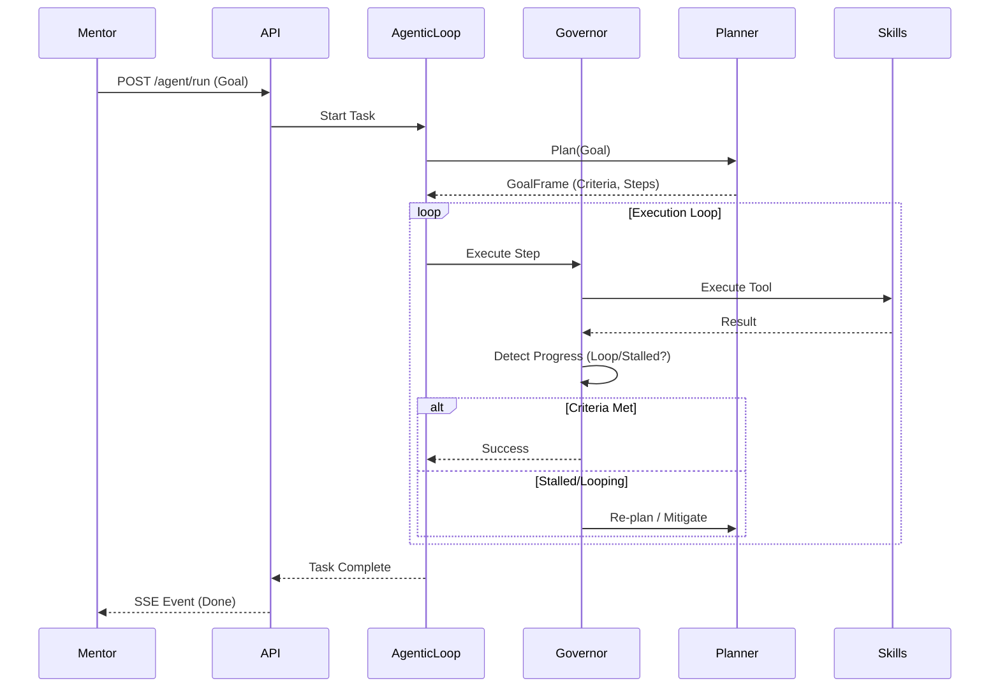

# Orion Dock Architecture & Engineering Guide

This document provides a comprehensive overview of the Orion Dock architecture, including system design, component interactions, data flows, and security models.

## 1. System Overview

Orion Dock is a **Docker-first**, **Rust-based** autonomous agent framework designed for ethical AI operations. It emphasizes:

- **Cryptographic Identity**: Ed25519-based identity with lineage verification.
- **Birth Lifecycle**: A five-stage interactive ceremony (Darkness → Emergence) for identity discovery.
- **Tier-Based Routing**: Dynamic model selection (Fast/Standard/Pro) based on task complexity.
- **Pro Council**: A Mixture-of-Agents (MoA) council for high-stakes reasoning.
- **Skill Sandboxing**: Tiered permission system for tool execution.
- **Dual Memory**: SQLite (default) or Postgres (vector/graph) backends.

### High-Level Architecture

```mermaid
graph TD
    User[User / Mentor] -->|HTTP/WebSocket| Frontend[React Frontend]
    Frontend -->|REST/SSE| API[Orion API (Axum)]
    
    subgraph "Orion Core Services"
        API --> Router[IdEgo Router]
        API --> Birth[Birth Orchestrator]
        API --> Skills[Skill Executor]
        API --> Memory[Memory Store]
        
        Router -->|Tier Selection| Council[Pro Council]
        Router -->|Direct| LLM[LLM Providers]
        
        Skills -->|Sandboxed| Tools[Skill Plugins]
        Skills -->|Protocol| MCP[MCP Servers]
        
        Birth -->|Crypto| Keyring[Keyring & Vault]
        Birth -->|Templates| Docs[Constitutional Docs]
    end
    
    subgraph "Infrastructure"
        Memory -->|SQL| SQLite[(SQLite)]
        Memory -->|SQL/Vector| Postgres[(Postgres)]
        LLM -->|API| OpenAI[OpenAI / Anthropic]
        LLM -->|Local| Ollama[Ollama / Local]
    end
```

---

## 2. Component Architecture (Crates)

The workspace is organized into a modular set of Rust crates:

| Crate | Responsibility | Key Dependencies |
|-------|----------------|------------------|
| `orion-api` | Axum HTTP server, WebSocket/SSE, Orchestration loop | `axum`, `tokio`, `tower-http` |
| `orion-core` | Config, Keyring, Vault, Templates, Verifier | `ed25519-dalek`, `chacha20poly1305` |
| `orion-birth` | Birth state machine, Chat runtime, Genesis paths | `orion-core`, `orion-soul-crystallization` |
| `orion-router` | IdEgoRouter, Pro Council DAG, Execution Governor | `orion-capabilities`, `async-trait` |
| `orion-skills` | Skill framework, MCP client, Sandboxing, Transport | `async-imap`, `lettre`, `reqwest` |
| `orion-capabilities` | LLM providers, Sensory modules, Model catalog | `async-openai`, `reqwest`, `scraper` |
| `orion-memory` | Abstract store, SQLite/Postgres implementations | `rusqlite`, `sqlx`, `pgvector` |
| `orion-soul-crystallization` | Psychometric engine (OCEAN, Moral Foundations) | `serde`, `thiserror` |
| `soul-forge` | TUI for scenario-based calibration | `ratatui`, `crossterm` |
| `orion-email` | OAuth2 adapters (Gmail, Outlook) | `reqwest`, `oauth2` |

---

## 3. Key Workflows & Sequence Diagrams

### 3.1 Birth Lifecycle (Darkness → Emergence)

The birth process establishes the agent's cryptographic identity and personality.



### 3.2 Operational Chat & Routing

Handling user messages with tier-based routing and tool execution.



### 3.3 Agentic Run (Autonomous Task)

Long-running autonomous tasks with the Execution Governor.



---

## 4. Data Architecture

### 4.1 Memory Store Schema

The system supports both SQLite and Postgres.

**Common Schema (SQLite & Postgres):**
- **`memories`**:
  - `id`: UUID (Primary Key)
  - `content`: Text (The memory content)
  - `weight`: Enum (Ephemeral, Distilled, Crystallized)
  - `created_at`: Timestamp
  - `agent_id`: Text (Scope)

**Postgres Extensions:**
- **`memory_embeddings`** (pgvector):
  - `memory_id`: FK -> memories
  - `embedding`: Vector(1536)
  - `model`: Text
- **`memory_edges`** (Graph):
  - `from_id`: FK -> memories
  - `to_id`: FK -> memories
  - `edge_type`: Text (DerivedFrom, CritiquedBy, etc.)
  - `weight`: Float

### 4.2 Configuration & Secrets

- **`config.json`**: General settings (paths, model preferences, tiers).
- **`secrets.bin`**: DPAPI-encrypted vault for API keys.
  - Namespace: `provider:{name}` (e.g., `provider:openai`).
- **`orchestration_jobs.json`**: Scheduled tasks.
- **`agentic_runs/{id}.json`**: Persisted run state.

---

## 5. Security Architecture

### 5.1 Identity & Verification
- **Ed25519 Keys**: Generated at birth. Public key stored in `external_pubkey.bin`.
- **Lineage Signing**: Hive Master Key signs Agent Public Key -> `hive_lineage.sig`.
- **Document Signing**: Constitutional docs (`soul.md`, `ethics.md`) signed by Agent Key. Verified on boot.

### 5.2 Skill Sandboxing (`orion-skills`)
Skills operate under strict permission tiers:

| Tier | Permissions | Resource Limits |
|------|-------------|-----------------|
| **Verified** (Core) | Full Network, FileSystem, Shell | 256MB RAM, 30s CPU |
| **AgentBuilt** (Dynamic) | Network (Safe), FS (Scoped) | 128MB RAM, 15s CPU |
| **Untrusted** (3rd Party) | Network (None), FS (None) | 64MB RAM, 10s CPU |

**Audit Logging**: All sensitive actions (File I/O, Network, Shell) are logged via `AuditAction`.

### 5.3 Network Security
- **SSRF Protection**: Local LLM URLs validated to `localhost`/`127.0.0.1`.
- **MCP Trust Policy**: Blocks cloud metadata IPs (e.g., `169.254.169.254`).
- **API Auth**: Optional Bearer token for API access.

---

## 6. Frontend Architecture

The frontend is a **React + Vite** Single Page Application (SPA).

### Structure
- **`App.tsx`**: Main state machine (Splash -> Hive -> Dashboard).
- **`api.ts`**: Comprehensive API client (Axios/Fetch wrapper).
- **Components**:
  - `OperationalChat`: Main chat interface with SSE streaming.
  - `AgenticPanel`: Autonomous run control and timeline.
  - `GenesisPathSelector`: Birth path selection UI.
  - `HiveScreen`: Agent management and identity selection.

### State Management
- **Local State**: `useState` / `useReducer` for component-level logic.
- **Optimistic UI**: Immediate feedback for chat and path selection.
- **Polling**: Status checks (3-5s) for birth state and job status.

---

## 7. Deployment & Infrastructure

### Docker Compose
- **Profiles**:
  - `full`: API, Postgres, Ollama, Frontend, Toolbox.
  - `dev`: Dev container with bind mounts.
- **Services**:
  - `orion-api`: Core logic (Port 8080).
  - `frontend`: Nginx serving React app (Port 3000).
  - `postgres`: `pgvector/pgvector:pg16`.
  - `ollama`: Local LLM inference.

### Kubernetes (K8s)
- **Manifests**: Located in `deploy/k8s/`.
- **ConfigMap**: Application config.
- **Secrets**: API keys and database credentials.
- **Deployments**: API and Frontend replicas.

### CI/CD (GitHub Actions)
- **`ci.yml`**:
  - `docker-build-test`: Fmt, Clippy, Unit Tests.
  - `docker-full-uat`: End-to-end integration tests with Postgres and UAT probes.

---

## 8. Future Roadmap

- **WASM Runtime**: Fully sandboxed execution for untrusted skills.
- **Superego L2**: Dedicated ethical oversight model in the loop.
- **Distributed Council**: P2P council nodes for decentralized reasoning.
- **Sub-Task Spawning**: Recursive agentic runs for complex goals.
