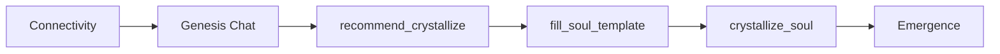

# Genesis Path: Direct Discovery

## Overview

**Direct Discovery** is the simplest Genesis path. The mentor and the agent have a short, natural conversation during which the agent discovers its **name**, **purpose**, and **personality**. The local LLM (Id) drives the dialogue using a fixed system prompt and, when all three pieces are gathered and confirmed, invokes the `recommend_crystallize` tool. The caller then fills the soul template and calls `crystallize_soul` to complete Genesis.

- **Audience:** Mentors who want a fast, straightforward path without psychometric profiling or scenario-based calibration.
- **Estimated time:** ~1 minute.
- **Path id:** `direct`.

## Flow Diagram



## Detailed Steps

1. **Start Genesis** — Mentor starts Genesis with path `direct`. The orchestrator advances from Connectivity to Genesis and persists the path. No special state (unlike Soul Forge) is created; the Genesis stage uses the birth chat with the Genesis system prompt.

2. **Conversation** — The agent (Id) runs with `GENESIS_SYSTEM_PROMPT`. It:
   - Asks what the mentor would like to call the agent (name).
   - Asks what the agent’s purpose should be (domains, problems to solve).
   - Asks about personality or tone (formal, casual, warm, direct, etc.).
   - Asks one question at a time, reflects back, and does not assume answers.

3. **Confirmation** — When name, purpose, and personality have been gathered, the LLM summarizes all three and asks the mentor to confirm (e.g. “Does this feel right?”). Only after an affirmative confirmation should the tool be called.

4. **recommend_crystallize** — The LLM outputs a `tool_request` block with `name: "recommend_crystallize"` and `arguments: { name, purpose, personality }`. The backend (or UI driver) must parse this, then:
   - Call `orion_core::templates::fill_soul_template(name, purpose, personality)` to produce `soul_content`.
   - Use `GROWTH_MD` (or equivalent) for `growth_content`.
   - Call `BirthOrchestrator::crystallize_soul(soul_content, growth_content)`.

5. **Emergence** — After `crystallize_soul`, the stage becomes Emergence; the rest of the birth flow (signing, birth memory, key drop) is unchanged.

## recommend_crystallize Tool

Defined in the Genesis system prompt. The LLM calls it by emitting:

```text
```tool_request
{"name": "recommend_crystallize", "arguments": {"name": "...", "purpose": "...", "personality": "..."}}
```
```

- **name** (string, required): The chosen agent name.
- **purpose** (string, required): One clear sentence for what the agent exists to do.
- **personality** (string, required): How the agent should communicate (tone, style).

Rules: Only call after (1) all three pieces are gathered, (2) summarized in the message, and (3) the mentor has confirmed.

## API Surface

| Method | Endpoint | Request | Response |
|--------|----------|---------|----------|
| POST | `/api/agents/:id/genesis/start` | `{ "path": "direct" }` | `{ "ok": true, "path": "direct" }` |

No path-specific state is returned (unlike Soul Forge). The agent is now in Genesis stage; the actual conversation is intended to be driven by a **birth chat** endpoint, which does not yet exist (see Current State).

## Key Code Locations

| Item | Location |
|------|----------|
| Path enum | `crates/orion-birth/src/stages.rs` — `GenesisPath::Direct` |
| Label / description / time | `crates/orion-birth/src/stages.rs` — `GenesisPath::description()`, `estimated_time()` |
| System prompt | `crates/orion-birth/src/prompts.rs` — `GENESIS_SYSTEM_PROMPT` |
| recommend_crystallize tool text | `crates/orion-birth/src/prompts.rs` — inside `GENESIS_SYSTEM_PROMPT` |
| Stage prompt lookup | `crates/orion-birth/src/prompts.rs` — `system_prompt_for_stage(BirthStage::Genesis)` |
| Birth chat / tool parsing | `crates/orion-birth/src/chat.rs` — `build_birth_messages`, `birth_chat_turn`, `parse_tool_requests` |
| Soul template | `crates/orion-core/src/templates.rs` — `SOUL_TEMPLATE_MD`, `fill_soul_template`, `GROWTH_MD` |
| Crystallize | `crates/orion-birth/src/stages.rs` — `BirthOrchestrator::crystallize_soul` |
| Genesis start API | `crates/orion-api/src/main.rs` — `api_genesis_start` (path `"direct"` → `GenesisPath::Direct`) |

## Output Contract

- The path must produce **(name, purpose, personality)** via the conversation and the `recommend_crystallize` tool.
- The caller must:
  1. Obtain these three from the tool call (parsed from the birth chat response).
  2. Compute `soul_content = fill_soul_template(name, purpose, personality)`.
  3. Use the standard growth content (e.g. `GROWTH_MD`).
  4. Call `crystallize_soul(soul_content, growth_content)`.

All Genesis paths converge on `crystallize_soul`; Direct Discovery does not add extra sections to the soul document (unlike Soul Forge’s calibration block).

## Current State

- **Implemented:** Genesis path enum and description; `GENESIS_SYSTEM_PROMPT` and `recommend_crystallize` text; `fill_soul_template` and `crystallize_soul`; `api_genesis_start` with `path: "direct"` advances the orchestrator to Genesis and persists the path.
- **Missing:** No HTTP endpoint to send a user message and receive the assistant reply plus tool requests for the Genesis (birth) chat. Therefore the web UI cannot drive the Direct Discovery conversation. UAT and headless flows bypass chat by calling `fill_soul_template` with fixed values and then `crystallize_soul`.

## Extensibility Notes

- Adding a new “simple chat” path would follow the same contract: same system prompt shape (or a variant), a tool to signal “ready to crystallize” with (name, purpose, personality), then `fill_soul_template` + `crystallize_soul`.
- To support Direct Discovery in the web UI, add a birth-chat API (e.g. `POST /api/agents/:id/birth/chat` with body `{ "message": "..." }`) that runs `birth_chat_turn`, returns assistant content and parsed tool requests, and handles `recommend_crystallize` by calling `fill_soul_template` and `crystallize_soul`.
