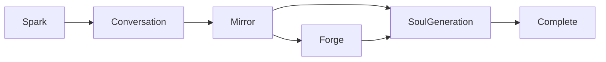

# Genesis Path: Soul Crystallization

## Overview

**Soul Crystallization** is a depth-based psychometric profiling path. The agent learns who the mentor is — how they think, what they value, how they want to work together — through an adaptive Socratic dialogue (and optionally a Mirror phase and a Forge phase for the deepest depth). The LLM emits `record_signal` tool calls to update a **MentorProfile** (OCEAN, moral foundations, attachment, cognitive style). When the profile is sufficiently complete or a turn cap is reached, the flow advances through phases; at SoulGeneration, the caller runs an extraction LLM pass over the transcript to obtain (name, purpose, personality), then fills the soul template, calibrates Triangle Ethic weights from the profile, and calls `crystallize_soul`.

- **Audience:** Mentors who want a more personal, psychologically grounded agent; the deeper the depth, the more tailored the result.
- **Estimated time:** Depends on depth — Quick Start ~30 seconds, Conversation 3–5 minutes, Deep Dive 10–15 minutes.
- **Path id:** `soul_crystallization` with optional `depth`: `quick_start`, `conversation`, `deep_dive`.

## Depth Levels

| Depth | Label | Time | Behavior |
|-------|--------|------|----------|
| Quick Start | quick_start | ~30 seconds | No dialogue. Engine starts at **SoulGeneration**; caller typically supplies default (name, purpose, personality) or a short form. |
| Conversation | conversation | 3–5 minutes | Adaptive Socratic dialogue. Starts at **Conversation** phase; then Mirror → SoulGeneration. |
| Deep Dive | deep_dive | 10–15 minutes | Full flow: Conversation → Mirror → **Forge** (ethical dilemmas, communication prefs, naming) → SoulGeneration. |

## Flow Diagram

- **Quick Start:** Start at SoulGeneration (skip Spark/Conversation/Mirror/Forge).
- **Conversation:** Start at Conversation; after Mirror go to SoulGeneration (no Forge).
- **Deep Dive:** Start at Conversation; after Mirror go to Forge, then SoulGeneration.

## Detailed Steps

1. **Start Genesis** — Mentor starts Genesis with path `soul_crystallization` and optional `depth`. The orchestrator creates a `CrystallizationEngine` with the chosen `DepthLevel` and advances to Genesis. The engine’s initial phase is Conversation (or SoulGeneration for Quick Start).

2. **Conversation phase** — User and assistant exchange messages. The LLM should output `record_signal` tool requests (see below). The backend calls `engine.process_response_from_tool_requests(assistant_content, tool_requests)`, which parses signals, applies them to `MentorProfile`, and appends the turn to conversation history.

3. **Phase advancement** — After each processed response, the caller checks `should_advance_phase()`. When true, call `advance_phase()` to move to the next phase. Conversation phase completes when profile confidence thresholds are met or turn count ≥ 10:
   - `avg_ocean_confidence >= 0.4`
   - `avg_moral_confidence >= 0.3`
   - `attachment_confidence >= 0.5`

4. **Mirror phase** — Mentor reflects on personality (e.g. “Mirror Moment”); the caller sets `engine.set_mirror_text(...)` when the mentor’s reflection is captured. `should_advance_phase()` for Mirror is true when `mirror_text.is_some()`.

5. **Forge phase** (Deep Dive only) — Ethical dilemmas, communication preferences, and naming. Implementation-specific; when done, advance to SoulGeneration.

6. **SoulGeneration** — Caller (a) builds extraction prompt from `engine.conversation_history()` via `build_extraction_prompt`, (b) calls the LLM, (c) parses response with `parse_extraction_response` to get `ExtractedIdentity` (name, purpose, personality), (d) optionally calls `engine.calibrate_ethics()` to set Triangle Ethic weights from the profile, (e) uses `fill_soul_template(name, purpose, personality)` and any profile/ethics content for soul_content, (f) calls `crystallize_soul(soul_content, growth_content)`.

## record_signal Tool

The LLM emits tool requests with `name: "record_signal"`. Arguments can be:

- A single object: `{"instrument": "...", "dimension": "...", "value": 0.5, "confidence": 0.8, "reasoning": "..."}`.
- An array of such objects: `[{ ... }, { ... }]`.
- An object with a `signals` array: `{"signals": [{ ... }]}`.

**Signal** fields:

- **instrument** (string): One of `big_five`, `moral_foundations`, `attachment`, `cognitive`.
- **dimension** (string): e.g. for big_five: `openness`, `conscientiousness`, `extraversion`, `agreeableness`, `neuroticism`; for moral_foundations: `care`, `fairness`, `loyalty`, `authority`, `sanctity`, `liberty`.
- **value** (number): 0–1 score.
- **confidence** (number): 0–1; used for blending with existing profile.
- **reasoning** (string): Optional explanation.

**MentorProfile** applies signals by instrument:

- **big_five** — Updates OCEAN scores; confidence-weighted blend per dimension.
- **moral_foundations** — Same for care, fairness, loyalty, authority, sanctity, liberty.
- **attachment** — Updates attachment style (secure, anxious, avoidant, disorganized); highest-confidence signal wins.
- **cognitive** — Updates cognitive style (thinking_mode, precision_vs_speed, breadth_vs_depth).

## Phase Advancement Criteria

| Phase | Condition to advance |
|-------|------------------------|
| Conversation | (ocean_ok && moral_ok && attachment_ok) \|\| turn_count >= 10 |
| Mirror | mirror_text.is_some() |
| Forge | Implementation-specific |
| SoulGeneration | true (caller proceeds to extraction and crystallize) |

## Extraction

- **Input:** `engine.conversation_history()` (transcript).
- **Function:** `build_extraction_prompt(conversation)` produces a prompt that asks the LLM to output a single JSON object with keys `name`, `purpose`, `personality`.
- **Parse:** `parse_extraction_response(response)` strips optional markdown code fences and deserializes into `ExtractedIdentity`.

## Triangle Ethic Calibration

`calibrate_triangle_ethic(profile)` maps `MentorProfile` to `TriangleEthicWeights` (deontological, areteological, teleological):

- Moral foundations: authority + sanctity → deontological; care + fairness → areteological; liberty + loyalty → teleological.
- OCEAN: conscientiousness, agreeableness, openness scale the three dimensions slightly.
- Attachment style: secure → areteological; anxious → deontological; avoidant → teleological (small deltas).
- Weights are normalized. The result can be used to annotate the soul document or growth content.

## API Surface

| Method | Endpoint | Request | Response |
|--------|----------|---------|----------|
| POST | `/api/agents/:id/genesis/start` | `{ "path": "soul_crystallization", "depth": "quick_start" \| "conversation" \| "deep_dive" }` | `{ "ok": true, "path": "soul_crystallization" }` |

Default `depth` if omitted is `quick_start`. There is no dedicated crystallization chat endpoint; the engine is created and stored in the orchestrator but the web UI does not yet drive the dialogue or extraction.

## Key Code Locations

| Item | Location |
|------|----------|
| Path enum | `crates/orion-birth/src/stages.rs` — `GenesisPath::SoulCrystallization { depth }`, `SoulCrystallizationDepth` |
| Depth mapping | `crates/orion-birth/src/stages.rs` — `depth_to_crystallization_depth`, `advance_to_genesis_with_path` |
| Engine | `crates/orion-soul-crystallization/src/engine.rs` — `CrystallizationEngine`, `process_response_from_tool_requests`, `should_advance_phase`, `advance_phase`, `parse_record_signal_args` |
| Models | `crates/orion-soul-crystallization/src/models.rs` — `DepthLevel`, `CrystallizationPhase`, `MentorProfile`, `Signal`, `OceanScores`, `MoralFoundations`, `AttachmentStyle`, `CognitiveStyle`, `TriangleEthicWeights`, `apply_signal` |
| Extraction | `crates/orion-soul-crystallization/src/extraction.rs` — `build_extraction_prompt`, `parse_extraction_response`, `ExtractedIdentity` |
| Ethics calibration | `crates/orion-soul-crystallization/src/ethics_calibrator.rs` — `calibrate_triangle_ethic` |
| Genesis start API | `crates/orion-api/src/main.rs` — `api_genesis_start` (path `soul_crystallization`, body.depth) |

## Output Contract

- The path must produce **(name, purpose, personality)**. For Quick Start the caller often supplies defaults; for Conversation/Deep Dive the caller uses extraction from the transcript.
- The caller must:
  1. Obtain (name, purpose, personality) — from extraction or defaults.
  2. Optionally run `engine.calibrate_ethics()` and use the weights in soul/growth content.
  3. Compute `soul_content` (e.g. `fill_soul_template` plus any Soul Crystallization–specific section).
  4. Call `crystallize_soul(soul_content, growth_content)`.

## Current State

- **Implemented:** Genesis path and three depths; `CrystallizationEngine` with phases, `record_signal` parsing, `MentorProfile` and signal application; extraction prompt and parser; Triangle Ethic calibration; `api_genesis_start` with path and depth creates the engine and advances to Genesis.
- **Missing:** No HTTP endpoint to send user messages and get assistant + tool requests for the crystallization conversation. The engine is not driven from the API or web UI. UAT uses a hardcoded identity and does not run the full dialogue or extraction.

## Extensibility Notes

- Adding a new depth (e.g. “Light”) would require a new `DepthLevel` and `SoulCrystallizationDepth` variant, and mapping in `advance_to_genesis_with_path` and in `CrystallizationEngine::new` (initial phase) and `advance_phase` (phase graph).
- Adding a new instrument (e.g. “values”) would require extending `Signal` handling in `MentorProfile::apply_signal` and, if needed, new profile fields and calibration logic in `calibrate_triangle_ethic`.
