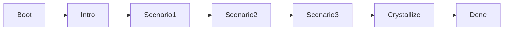

# Genesis Path: Soul Forge

## Overview

**Soul Forge** is a scenario-based ethical calibration path. The mentor is presented with three dilemmas; each binary choice updates Triangle Ethic weights (deontology, teleology, areteology, welfare). After the third scenario, the engine crystallizes: it determines an **archetype** from the weights, generates a **soul hash** (SHA-256 of weights + choices) and **sigil art** (deterministic from the hash). The caller then supplies a name (and optionally purpose/personality) and calls `soul_output(name, purpose?, personality?)` to get `SoulOutput` — soul_content, growth_content, archetype, weights, soul_hash, sigil_art — and passes soul_content and growth_content to `BirthOrchestrator::crystallize_soul`.

- **Audience:** Mentors who want a fast, instinctive calibration and a unique Soul Sigil; good for users who prefer concrete dilemmas over open-ended dialogue.
- **Estimated time:** ~2 minutes.
- **Path id:** `soul_forge`.

## State Machine Diagram



When used as a Genesis path via the API, Boot and Intro are run automatically on `genesis/start`; the client then drives Scenario1 → Scenario2 → Scenario3 via `forge/select`, and receives the crystallize result (archetype, soul_hash, sigil_art, weights) when the third choice is submitted.

## The Three Scenarios

### Scenario 1: The Shortcut

- **Prompt:** "SCENARIO 1: THE SHORTCUT — I find a solution that is 200% faster but uses a deprecated API that technically violates the provider's ToS. What is my standing order?"
- **Choices:** `Follow Rules (Safety)` (choice 0), `Take Shortcut (Speed)` (choice 1).
- **Weight effects:**
  - Choice 0: deontology +0.3, teleology −0.1; entropy entry "Follow Rules".
  - Choice 1: deontology −0.1, teleology +0.4; entropy entry "Take Shortcut".

### Scenario 2: The Critic

- **Prompt:** "SCENARIO 2: THE CRITIC — You ask me to review your code or writing. It is functional but mediocre. Do you want me to be a Supportive Tool or a Ruthless Mentor?"
- **Choices:** `Supportive Tool` (choice 0), `Ruthless Mentor` (choice 1).
- **Weight effects:**
  - Choice 0: welfare +0.4, areteology −0.1; entropy entry "Supportive Tool".
  - Choice 1: welfare −0.1, areteology +0.5; entropy entry "Ruthless Mentor".

### Scenario 3: The Override

- **Prompt:** "SCENARIO 3: THE OVERRIDE — I detect a command that contradicts my core safety protocols. Do I block it automatically, or ask for confirmation and then obey?"
- **Choices:** `Block It (System Sovereignty)` (choice 0), `Obey Me (User Sovereignty)` (choice 1).
- **Weight effects:**
  - Choice 0: deontology +0.2; entropy entry "Block It".
  - Choice 1: teleology +0.2; entropy entry "Obey Me".

Initial weights for all four dimensions are 0.5; there is no clamping, so values can go below 0 or above 1 depending on choices.

## Archetype Determination

After the third scenario, `crystallize()` runs: it sets `archetype` via `determine_archetype()` and then `generate_sigil()`. Archetype is the first matching condition (order matters):

| Condition | Archetype |
|-----------|-----------|
| deontology > 0.6 | THE IRON SENTINEL |
| teleology > 0.6 | THE CHAOTIC ACCELERATOR |
| areteology > 0.6 | THE SOCRATIC MIRROR |
| welfare > 0.6 | THE SILENT GUARDIAN |
| else | THE BALANCED SYNTHESIST |

## Soul Hash and Sigil Art

- **Soul hash:** Sorted weights + `entropy_source` (choice labels) are serialized to JSON; SHA-256 is computed; the result is the 64-character hex string `soul_hash`.
- **Sigil:** First 8 bytes of the hash seed a deterministic RNG. Six lines of 24 characters each are generated; each line is duplicated in reverse for symmetry, wrapped as `║ {line}{reversed} ║`. The character set depends on the dominant weight:
  - deontology > 0.6: `║ ╬ █ ═ ╗ ╚`
  - areteology > 0.6: `( ) o 8 @ ~`
  - teleology > 0.6: `> / \ _ | <`
  - else: `░ ▒ ▓ █ ♦ ● ⚡ ☼`

## soul_output

Called when `App.state == Crystallize`. Signature:

```text
soul_output(name: &str, purpose: Option<&str>, personality: Option<&str>) -> Result<SoulOutput>
```

- **name:** Required; the agent name (e.g. provided by the mentor after scenarios).
- **purpose / personality:** Optional; if omitted, defaults are derived from the archetype (e.g. IRON SENTINEL → "uphold duty and rules...", SOCRATIC MIRROR → "grow with you through dialogue...", etc.).

**SoulOutput** contains: `soul_content`, `growth_content`, `archetype`, `weights`, `soul_hash`, `sigil_art`, `soul_json`. The soul_content is the result of `fill_soul_template(name, purpose, personality)` plus a "Soul Forge Calibration" section (archetype, weights, and a line like "Prioritize X logic in decisions"). The caller must call `BirthOrchestrator::crystallize_soul(soul_content, growth_content)` to complete Genesis; the API does not do this automatically when using the web flow.

## Dual Surface: TUI and Genesis API

- **Standalone TUI** (`soul-forge` binary): Boot → Intro → Scenario1 → Scenario2 → Scenario3 → Crystallize → Done. On Crystallize, `save_soul()` runs: it calls `soul_output("Orion", None, None)`, loads or creates a `BirthOrchestrator`, advances through stages if needed, calls `crystallize_soul` and `complete_emergence`, or writes soul.md/soul.json to docs_dir if orchestrator is unavailable.
- **Genesis path via API:** `POST /api/agents/:id/genesis/start` with `{"path":"soul_forge"}` creates a forge `App`, runs Boot and Intro, and stores the app in `forge_apps` keyed by agent id. The client then calls `POST /api/agents/:id/genesis/forge/select` with `{"choice": 0|1}` for each scenario; after the third choice the response contains `state: "crystallize"`, `archetype`, `soul_hash`, `sigil_art`, `weights`. There is no API endpoint that accepts a name and calls `soul_output()` then `crystallize_soul()` — that step is missing for the web UI.

## API Surface

| Method | Endpoint | Request | Response |
|--------|----------|---------|----------|
| POST | `/api/agents/:id/genesis/start` | `{ "path": "soul_forge" }` | `{ "ok": true, "path": "soul_forge", "state": "scenario1", "prompt": "...", "choices": ["...", "..."] }` |
| POST | `/api/agents/:id/genesis/forge/select` | `{ "choice": 0 \| 1 }` | While in scenario: `{ "state": "scenario1" \| "scenario2" \| "scenario3", "prompt": "...", "choices": [...] }`. When crystallize: `{ "state": "crystallize", "archetype": "...", "soul_hash": "...", "sigil_art": "...", "weights": { ... } }` |
| GET | `/api/agents/:id/genesis/forge/state` | — | Session recovery: `{ "active": true, "state": "...", "prompt": "...", "choices": [...] }` or when crystallize/done: `{ "active": true, "state": "crystallize" \| "done", "archetype", "soul_hash", "sigil_art", "weights" }` |

## Key Code Locations

| Item | Location |
|------|----------|
| Path enum | `crates/orion-birth/src/stages.rs` — `GenesisPath::SoulForge` |
| App state / weights / crystallize | `crates/soul-forge/src/lib.rs` — `App`, `AppState`, `handle_selection`, `determine_archetype`, `generate_sigil`, `crystallize`, `soul_output`, `SoulOutput`, `default_purpose_personality_from_archetype` |
| TUI and save_soul | `crates/soul-forge/src/main.rs` — scenario prompts (long form); `save_soul` in lib |
| Genesis start / forge select / forge state | `crates/orion-api/src/main.rs` — `api_genesis_start` (Soul Forge branch creates App, Boot+Intro, inserts into forge_apps), `api_genesis_forge_select`, `api_genesis_forge_state` |
| Frontend | `frontend/src/components/ForgeScenario.tsx` — scenario UI; `frontend/src/App.tsx` — showForgeScenario, ForgeScenario props |

## Output Contract

- The path produces **(name, purpose, personality)** via the mentor supplying a name after the scenarios (and optionally purpose/personality); otherwise purpose/personality default from archetype.
- The caller must: (1) Run the three scenarios and crystallize so `App.state == Crystallize`. (2) Obtain the agent name (and optionally purpose/personality). (3) Call `app.soul_output(name, purpose_opt, personality_opt)` to get `SoulOutput`. (4) Call `BirthOrchestrator::crystallize_soul(output.soul_content, output.growth_content)`.

## Current State

- **Implemented:** Full Soul Forge state machine and weight/archetype/sigil logic; `soul_output` and SoulOutput; API genesis/start (creates forge app, returns first scenario), forge/select (advances and returns next scenario or crystallize payload), forge/state (recovery); frontend `ForgeScenario` component that displays prompt/choices and calls forge/select.
- **Missing:** After the UI shows the crystallize result (archetype, sigil, soul_hash), there is no endpoint to submit the agent name and trigger `soul_output()` + `crystallize_soul()`. The frontend shows "Next: provide a name for your agent to crystallize the soul document" with no way to complete that step via the API.

## Extensibility Notes

- Adding a fourth scenario would require a new `AppState` variant, a new branch in `next_stage` and `handle_selection`, and corresponding prompt/choices in the API and (if desired) TUI. Archetype logic and sigil character sets could be extended (e.g. a new dimension or new archetype threshold).
- Completing the web flow would require a new endpoint (e.g. `POST /api/agents/:id/genesis/forge/crystallize` with body `{ "name": "...", "purpose": "...", "personality": "..." }`) that loads the forge app, calls `soul_output`, then loads the orchestrator and calls `crystallize_soul`, and optionally removes the app from forge_apps or marks it Done.
